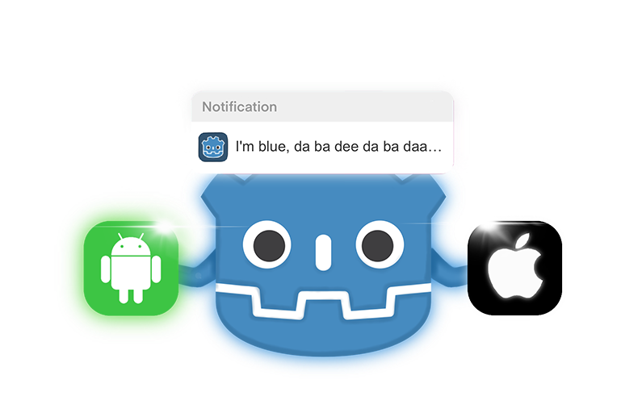
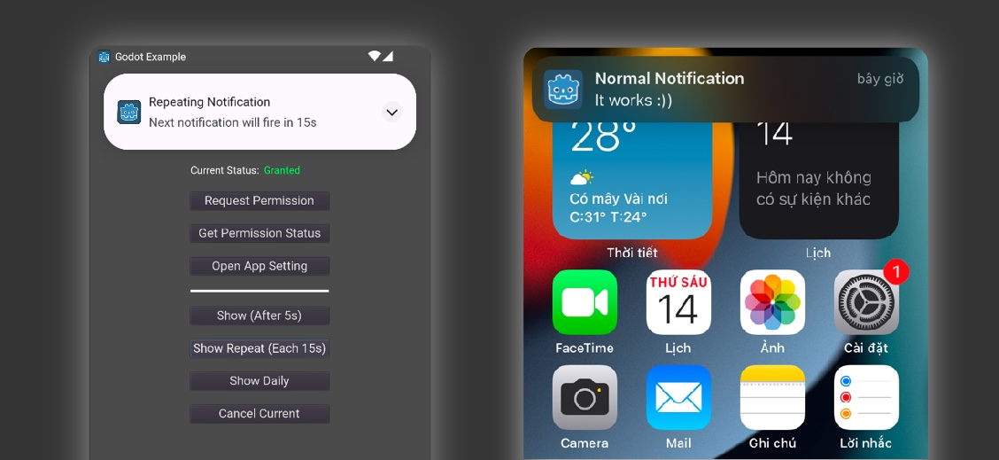

<h1 align="center">
  <br>
  
  <br>
  Godot Local Notification
  <br>
</h1>

<h4 align="center">Godot plugin to send Local Notification on Android/iOS. Supports Godot 3 & 4</a>.</h4>

<p align="center">
  <a href="https://github.com/kyoz/godot-local-notification/releases">
    
  </a>
  <span>&nbsp</span>
  <a href="https://github.com/kyoz/godot-local-notification/actions">
    
  </a>
  <span>&nbsp</span>
  <a href="https://github.com/kyoz/godot-local-notification/releases">
    
  </a>
  <span>&nbsp</span>
  
  <span>&nbsp</span>
  
</p>

<p align="center">
  <a href="#about">About</a> •
  <a href="#caution">Caution</a> •
  <a href="#installation">Installation</a> •
  <a href="#customize">Customize</a> •
  <a href="#usage">Usage</a> •
  <a href="#api">API</a> •
  <a href="#contribute">Contribute</a> •
  <a href="https://github.com/kyoz/godot-local-notification/releases">Downloads</a> 
</p>

<p align="center">
  
</p>

# About

This plugin helps send Local Notifications (Android/iOS). Send oneshot or daily notifications at a specified time to user.

This plugin only handles Local Notification, it does NOT support Remote Notification.

Built using automation scripts combined with CI/CD to help speed up the release progress as well as the release of hotfixes which save some of our time.

Supports Godot 3 & 4.

# Caution

This plugin supports the latest Android (13+) and iOS. But there are some things you should know before using.

The notification time may be delayed by a few seconds or in worst cases, minutes. For instance, when the user turn on Battery Optimizaztion mode, the notifications will be further delayed or even not displayed. That's because I'm avoiding using `unsafe` permissions (Android). It's risky and can crash your app/game, which is not worth it.

On iOS, the minimum `repeating_interval` is 60 seconds.

You shouldn't abuse too many notifications and annoy the user. Schedule notifications at specific moments like when player's energy is full, when a tree grows or something like that...

When pushing a set of notifications, try to store their tag somewhere, in case you want to remove them and schedule a new set.

# Installation

## Android

Download the [Android plugin](https://github.com/kyoz/godot-local-notification/releases) (match your Godot version), and extract them to `your_project/android/plugins`

Enable `LocalNotification` plugin in your Android export preset.

*Note*: You must [use custom build](https://docs.godotengine.org/en/stable/tutorials/export/android_custom_build.html) for Android to use plugins.

## iOS

Download the [iOS plugin](https://github.com/kyoz/godot-local-notification/releases) (match your Godot version), and extract them to `ios/plugins`

Enable `LocalNotification` plugin in your iOS export preset.

# Customize

On Android, you can change the color of notifications by adding `notification-color.xml` to your app's `android/build/res/values` folder with the following content:

```
<?xml version="1.0" encoding="utf-8"?>
<resources>
    <color name="notification_color">#000000</color>
</resources>
```

The default color is black (#000000).

You should also use [this](https://romannurik.github.io/AndroidAssetStudio/icons-notification.html) or [Image Asset Studio](https://developer.android.com/studio/write/create-app-icons) (in Android Studio) to generate your notification icon, and put them in mipmap folders.

The name of the notification icon must be `notification_icon.png`

```
android/build/res/mipmap*/notification_icon.png
```

On iOS, the notification icon will be the your App Icon so there's no need to do anything except designing your beautiful icon.

# Usage

An `autoload` script is provided for easier use of this plugin.

Download the [autoload file](./autoload) (match your Godot version). Add it to your project `autoload` list.

Then you can easily use the plugin anywhere with:

```gdscript
LocalNotification.init()

LocalNotification.requestPermission()

# To ensure the request process has finished, you can use the signal,
# I prefer this
yield(LocalNotification, "on_permission_request_completed")

if LocalNotification.isPermissionGranted():
  LocalNotification.show(title, message, 30, 10)
```

"Why do I have to call `init()`?" Well, if you don't want to, you can change `init()` to `_ready()` on the `autoload` file. But in my experience, when using a lot of plugin, initializing all plugins on `_ready()` is not a good idea. This way, you can choose whenever to initialize the plugin e.g. when showing a loading scene, etc.

For more details, see [examples](./example/).

# API

## Methods

> `isPermissionGranted`() -> bool

Used to check current status of permission. Returns `true` if permission is granted, `false` if it is not granted or denied.

> `requestPermission`() -> void

Used to request permission to push local notification. On Android <= 12, the permission is always granted. But you should call it anyway to have a clean code base across all versions and platforms.

> `openAppSetting`() -> void

Used to open App Settings. When the user has denied once on iOS and twice on Android, the permission dialog will never appear again. So I make this handy method for the user to jump to App Settings so they can re-activate notification.

*WARNING*: If `isPermissionGranted()` still returns `false` after calling `requestPermission()`, it means the user has denied the permission. You can use this function to help them easily toggle notification on. But you should prompt the user, e.g. with a dialog, to let them know whether to open App Settings or not. Don't just jump out of the app without any pre-notice, they will be confused and may be discouraged to re-open your app :(

> `show`(title, message, interval, tag) -> void

Used to show a notification after `interval` seconds. `interval` must be greater than 0. And on `iOS` the notification may not be displayed if the app is running on the foreground.

> `showRepeating`(title, message, interval, repeat_interval, tag) -> void

Similar to `show()`, but the notification will be pushed once every `repeat_interval`.

> `showDaily`(title, message, at_hour, at_minute, tag) -> void

Show a daily notification at your chosen hour and minute.

> `cancel`(tag) -> void

Cancel notifications with this `tag`. When pushing a set of notifications, try to store their tag somewhere, in case you want to remove them and schedule a new set.

## Signals

```gdscript
signal on_permission_request_completed() # emits when the permission request flow is completed
```

# Contribute

I want to help contribute to the Godot community so I create these plugins. I've prepared almost everything to help simplify and speed up the development and release progress.

With only one command, you can build and release this plugin. Read [DEVELOP.md](./DEVELOP.md) for more information.

If you find bugs, please open issues.

If you have time to fix bugs or improve the plugins, please open a PR. It's always welcomed and appreciated.

# License

MIT © [Kyoz](mailto:banminkyoz@gmail.com)